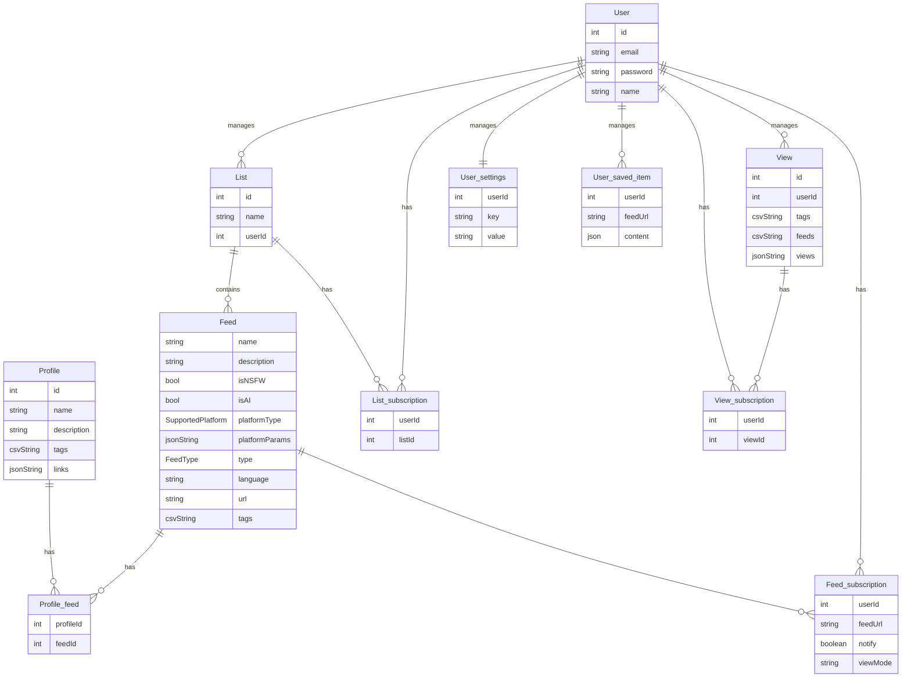
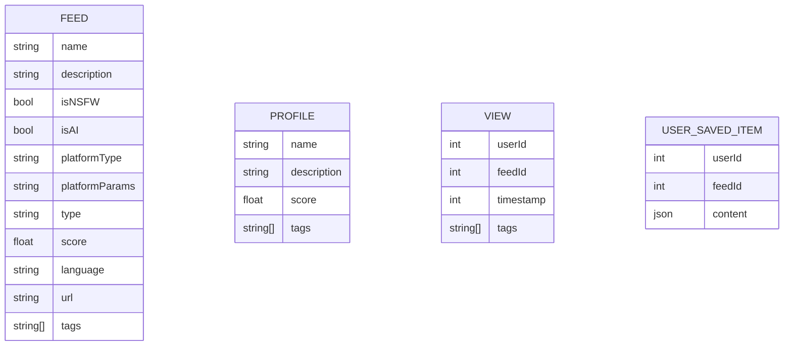

# Storage

This file outlines the way data is stored for menteka. The data is stored in two places: remote storage and local storage. Local storage ensures that this application can be used offline.

## Remote storage

Each entity represents a row in a table.



## Local storage

### Local Database

A local database exists to keep track of the user's subscriptions and views.



### Local Store

The store is used to keep track of the user's preferences.

```mermaid

Store (Local key-value store)

| Key          | Description  |
| ------------ | ------------ |
| mode         | light/dark   |
| theme        | string theme |
| syncSettings | boolean      |

## Syncing

When mutations are made to the local storage, they are synced with the remote storage. If the remote storage is not available, the mutations are stored in a queue and are synced when the remote storage is available.

CREATE TABLE IF NOT EXISTS FEEDS (id INTEGER PRIMARY KEY AUTOINCREMENT, name TEXT NOT NULL, description TEXT, isNSFW INTEGER DEFAULT 0, isAI INTEGER DEFAULT 0, platformType TEXT, platformParams TEXT, type TEXT, score REAL DEFAULT 0, language TEXT, url TEXT UNIQUE NOT NULL);

CREATE TABLE IF NOT EXISTS TAGS (id INTEGER PRIMARY KEY AUTOINCREMENT, name TEXT UNIQUE NOT NULL);

CREATE TABLE IF NOT EXISTS FEED_TAGS (feed_id INTEGER, tag_id INTEGER, PRIMARY KEY (feed_id, tag_id), FOREIGN KEY (feed_id) REFERENCES FEEDS(id), FOREIGN KEY (tag_id) REFERENCES TAGS(id));

CREATE TABLE IF NOT EXISTS PROFILES (id INTEGER PRIMARY KEY AUTOINCREMENT, name TEXT NOT NULL, description TEXT, iconUrl TEXT, logoUrl TEXT, socialLinks TEXT, officialUrl TEXT, type TEXT CHECK(type IN ('independent', 'commercial', 'nonprofit', 'educational', 'community')), location TEXT);

CREATE TABLE IF NOT EXISTS PROFILE_FEEDS (profile_id INTEGER, feed_id INTEGER, PRIMARY KEY (profile_id, feed_id), FOREIGN KEY (profile_id) REFERENCES PROFILES(id), FOREIGN KEY (feed_id) REFERENCES FEEDS(id));

type: blog, podcast, newsletter, etc.
```
